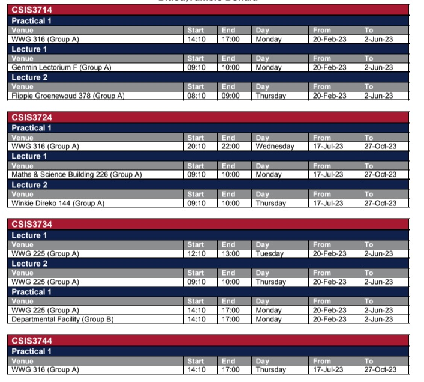
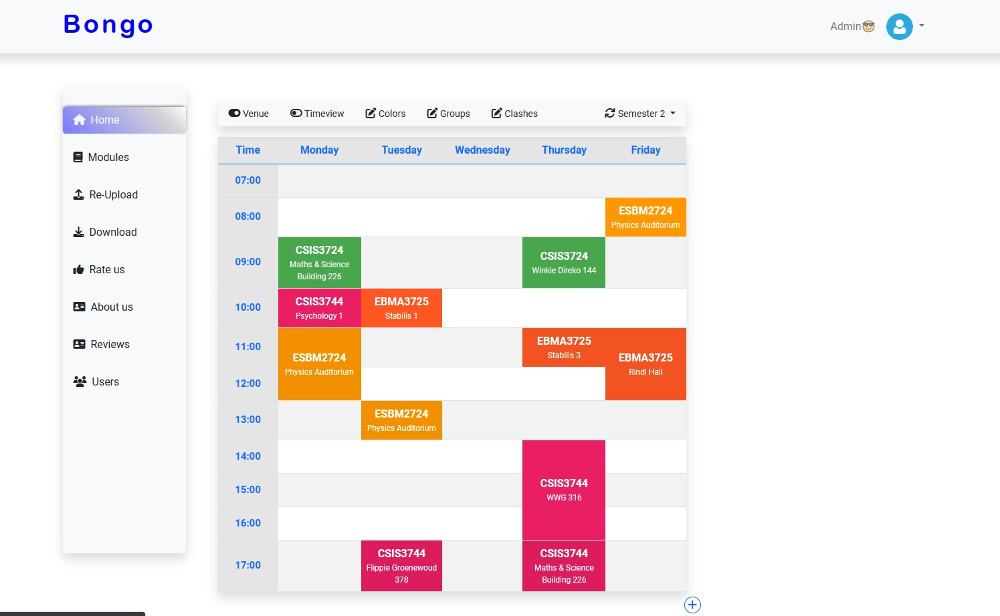

# Bongo 

Bongo is a user-friendly web application designed to revolutionize the way students create and manage their class timetables. With Bongo, students can now effortlessly convert the complex and often confusing timetables provided by their educational institutions 
(only UFS students at the moment) into a well-organized and customizable format, all within a matter of seconds. No more struggling to decipher long lists of classes and schedules!

## Key Features
- **Easy Timetable Creation**: Bongo streamlines the process of creating timetables by coverrting the pdf timetable provided by the institution and presenting it in a clear and user-friendly manner. Say goodbye to manual schedule planning!

- **Customization Options**: Students can customize their timetables to suit their preferences. Bongo allows users to choose different color schemes, add personal notes, and adjust the layout to ensure a personalized experience.

- **Download and Print**: Once the timetable is created and customized, students can easily download and print their schedules. Whether it's for keeping a hard copy or having it handy on their devices, Bongo makes it simple.

- **Conflict Resolution**: Dealing with timetable clashes can be frustrating. Bongo comes to the rescue by identifying any overlapping classes and offering solutions to resolve conflicts. No more last-minute scrambles to rearrange schedules!

### Snippets 
From 

To 

## How to Use Bongo
https://bongosupport-001-site1.atempurl.com/ 

Test timetable:  https://drive.google.com/file/d/1Ao1QOX_AoaX7vLZgafedGMxEk4_S6C9F/view?usp=sharing 

1. **Sign Up/Login**: Students can create an account on Bongo or log in if they already have one.

2. **Import Timetable**: After logging in, users can import their class timetables provided by the institution. Bongo will process the pdf and present it in an organized manner.

3. **Clash Resolution**: If any clashes are detected in the timetable, Bongo will highlight them and propose solutions to resolve conflicts.

4. **Customize**: Once the timetable is generated, students can customize it to their liking. They can choose colors for different subjects, add personal reminders or notes, and adjust the layout.

5. **Download**: After making the necessary customizations, users can download the final timetable.

## Collaboration

Bongo was not developed by a single individual, but through the collaborative efforts of two talented programmers, **Ditlou Tumelo(me)** and **Oliver Mpofu**. Our combined skills and dedication have resulted in the creation of this exceptional web application.

### Meet the Team

- **Ditlou Tumelo**
  - Role: Programmer (student)
  - GitHub: https://github.com/tumelo001
  - LinkedIn: https://www.linkedin.com/in/tumelo-ditlou-57051420b/
  - Email: tumeloditlou7@gmail.com

- **Oliver Mpofu**
  - Role: Programmer (student)
  - GitHub: https://github.com/MpofuO
  - LinkedIn: https://www.linkedin.com/in/olivermpofu/
  - Email: 	mpofuoliver1109@gmail.com

### Collaboration Workflow

Throughout the development of Bongo (still continuing), **Ditlou Tumelo(me)** and **Oliver Mpofu** worked together closely, sharing ideas, dividing tasks, and providing valuable feedback to each other. Our collaboration was based on open communication and mutual respect for each other's expertise, which significantly contributed to the success of the project.

### Gratitude

**Ditlou Tumelo(me)** and **Oliver Mpofu** would like to express our sincere gratitude to each other for the incredible teamwork and dedication that went into bringing Bongo to life. We are proud of what we have achieved together and look forward to further enhancing the application to benefit students.

Bongo is a testament to the power of collaboration and the shared passion for creating innovative solutions. It stands as a proud symbol of **Ditlou Tumelo** and **Oliver Mpofu**'s collective commitment to excellence in software development.
